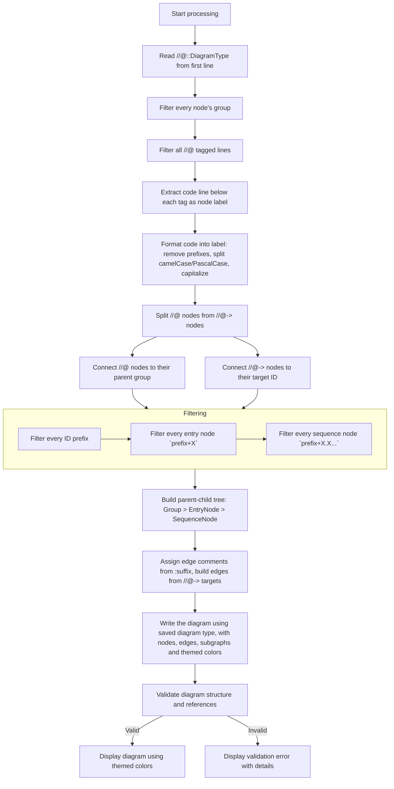
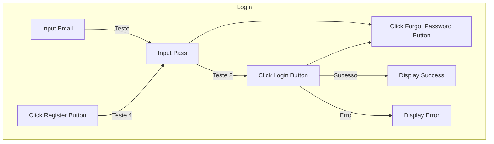

---

## Comportamento Detalhado

### Formato das Tags

Cada tag é uma linha de comentário que **marca a linha de código abaixo dela**:

```
//@ID:EdgeComment     ← tag (retro: conecta ao pai)
void minhaFuncao();  ← código que vira o nó
```

```
//@->TargetID:Comment  ← tag (target: conecta ao alvo)
algumCodigo();        ← código que vira o nó
```

### Tratamento do Código para Label do Nó

O código abaixo da tag é processado para gerar o label exibido no diagrama:

| Código original | Label gerado |
|---|---|
| `class Login {}` | `Login` |
| `void inputEmail();` | `Input Email` |
| `void inputPass();` | `Input Pass` |
| `void clickLoginButton();` | `Click Login Button` |
| `void clickForgotPasswordButton();` | `Click Forgot Password Button` |
| `_tryLogin();` | `Try Login` |
| `val usuario = getUser();` | `Val Usuario = Get User` |

**Regras de formatação:**
1. Remover prefixos comuns: `void`, `class`, `fun`, `def`, `function`, `const`, `val`, `var`, `let`
2. Remover sufixos: `();`, `()`, `{}`, `;`
3. Remover underscores `_` no início
4. Separar em palavras nos limites de camelCase/PascalCase
5. Capitalizar primeira letra de cada palavra

### Comentários nas Arestas

O sufixo `:Comentario` após o ID da tag define o **comentário da aresta** (edge label), não o label do nó:

```
//@Login1.1:Teste        ← "Teste" é comentário da aresta (edge label)
void inputPass();        ← "Input Pass" é o label do nó
```

### Tipos de Conexão

| Tag | Tipo | Comportamento |
|---|---|---|
| `//@ID:suffix` | Retro | Para **sequence nodes**, conecta ao nó pai imediato na hierarquia. A aresta recebe `suffix` como label. **Entry nodes** não geram aresta — a relação com o grupo é implícita pelo subgraph. |
| `//@->TargetID:suffix` | Target | Conecta o nó ao **alvo específico** `TargetID`. A aresta recebe `suffix` como label. |

### Níveis de Nós

| Nível | Formato | Exemplo |
|---|---|---|
| Grupo | Apenas letras | `Login`, `Signup`, `Home` |
| EntryNode | Prefixo + número inteiro | `Login1`, `Signup2`, `Home1` |
| SequenceNode | Prefixo + número sequencial | `Login1.1`, `Login1.1.1`, `Home1.2.2` |

A hierarquia é definida pelo ID: `Login1.1` é filho de `Login1`, que é filho de `Login` (grupo).

---

## Exemplo de Uso

### Entrada

```typescript
//@::flowchart TD
//@Login
class Login {}

//@Login1
void inputEmail();

//@Login1.1:Teste
void inputPass();

//@Login1.1.1:Teste 2
//@->Login1.1.2
void clickLoginButton();

//@Login1.1.2
void clickForgotPasswordButton();

//@Login2
//@->Login1.1:Teste 4
void clickRegisterButton();

//@Login1.1.1.1:Sucesso
void displaySuccess();

//@Login1.1.1.2:Erro
void displayError();
```

### Saída Esperada


