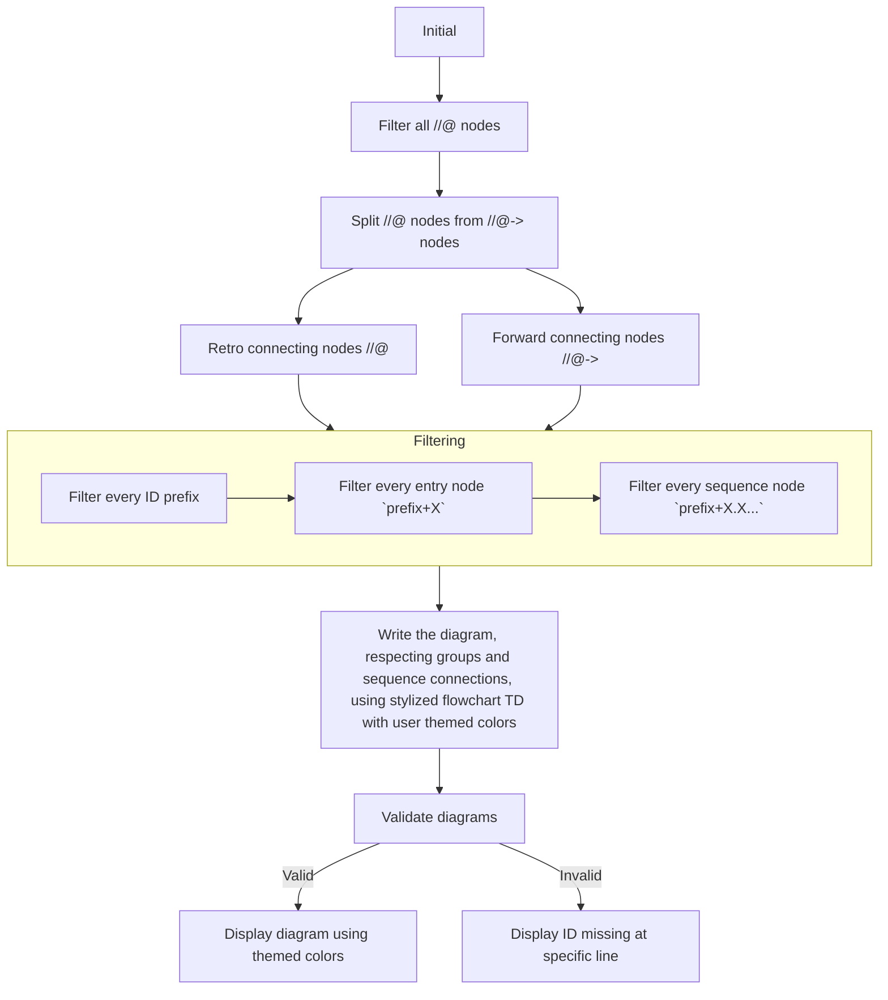

```mermaid
    flowchart TD

    Initial --> FilterNodes[Filter all //@ nodes]
    FilterNodes --> SplitTypes[Split //@ nodes from //@-> nodes]
    SplitTypes --> RetroPointers[Retro connecting nodes //@]
    RetroPointers --> Filtering
    
    SplitTypes --> ForwardPointers[Forward connecting nodes //@->]
    ForwardPointers --> Filtering
    Filtering --> WriteDiagram[Write the diagram, respecting groups and sequence connections, using stylized flowchart TD with user themed colors] 
    WriteDiagram --> Validate[Validate diagrams]
    Validate --> |Valid|Display[Display diagram using themed colors]
    Validate --> |Invalid|Invalid[Display ID missing at specific line]
    
    subgraph Filtering
        FilterGroups[Filter every ID prefix]
        FilterGroups --> FilterPrefix[Filter every entry node `prefix+X`]
        FilterPrefix --> FilterSequences[Filter every sequence node `prefix+X.X...`]
    end
```